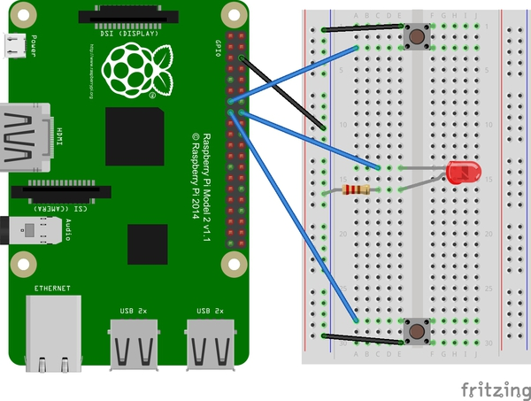

# (cheater's) Reaction Game
This is a quick Raspberry Pi game.

#### Step One:

Connect the one button to pin 27, another  button to pin 22, and an LED with an in-line resistor (I think I used 270ohms) to pin 23.

#### Step Two:
Open the reactionGame.py script with Idle3. Hit "F5" to run.

The script randomly lights up the LED between 1 and 5 seconds and keeps score for players one and two, however if the buttons are pressed at the same time the one evaluated first in the while loop always wins. 
